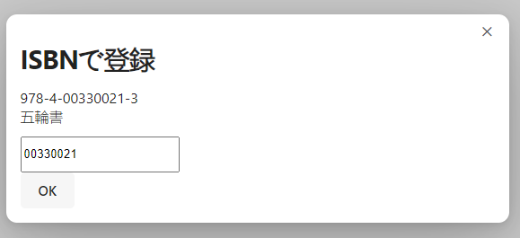
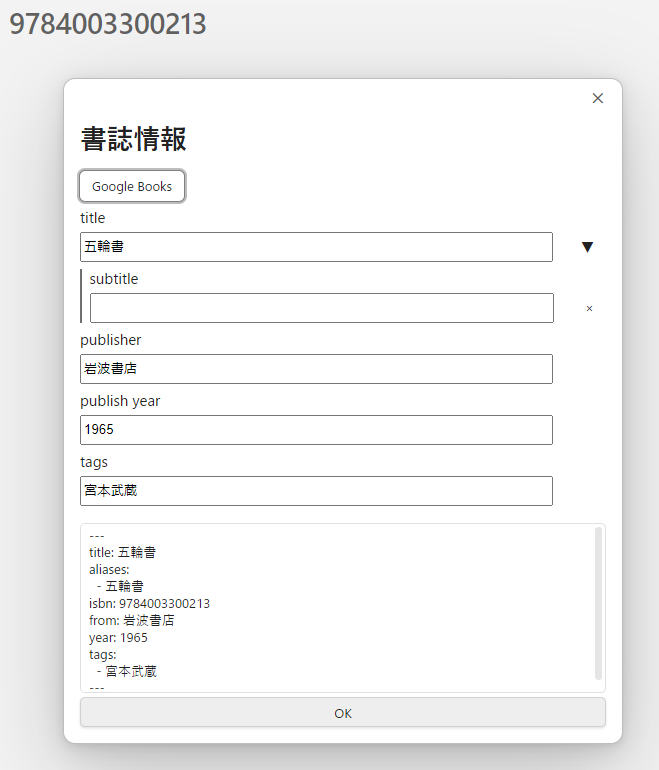
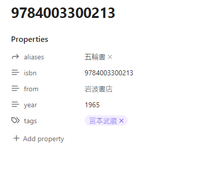
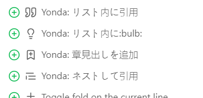

# Obsidian Yonda









Obsidian for [this](https://github.com/AWtnb/bookscrap).

ISBNで書誌情報を取得してObsidianに登録する。

## Install

Run [install.ps1](install.ps1) with vault folder path as an argument.

管理対象のフォルダパスを引数にして [install.ps1](install.ps1) を実行する。

```
# Example
.\install.ps1 C:\Users\awtnb\Obsidian\yonda-log
```

### Manual install

Copy over `main.js`, `styles.css`, `manifest.json` to `VaultFolder/.obsidian/plugins/obsidian-yonda/` .

`main.js` ・ `styles.css` ・ `manifest.json` をそれぞれ `（管理対象のフォルダ）/.obsidian/plugins/obsidian-yonda/` にコピーしてもインストール可能。

---

- Generated from [obsidian-sample-plugin](https://github.com/obsidianmd/obsidian-sample-plugin)
- [API Documentation](https://github.com/obsidianmd/obsidian-api)
- [Mobile development](https://docs.obsidian.md/Plugins/Getting+started/Mobile+development)

    ```JavaScript
    this.app.emulateMobile(!this.app.isMobile);
    ```

